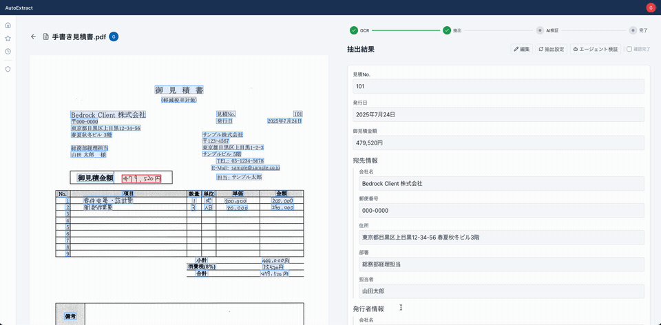
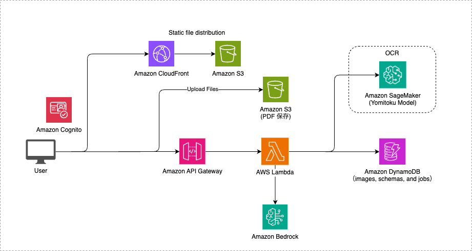

# AutoExtract

AutoExtract は OCR + Bedrock を活用した帳票読み取りの AI-OCR ソリューションです。帳票からの情報抽出を半自動化し、人間によるデータ入力チェックをサポートするツールです。

デモ



## アーキテクチャ



## デプロイ手順

デプロイの際は、事前に Node.js、Docker のインストールが必要です。

### パラメータ設定

アプリケーションのパラメータは `lib/parameters.ts` で管理しています。従来の `cdk.json` での管理から移行しました。

移行の理由:
- TypeScript の型安全性により、パラメータの設定ミスをコンパイル時に検出できる
- 環境変数 `ENV` による dev/stg/prod の環境切り替えが容易になる
- テスト時に環境を切り替えやすくなる
- `cdk.json` が CDK feature flags のみになり見通しが良くなる

#### 環境の切り替え

`ENV` 環境変数で環境を指定します。未指定の場合は `base`（デフォルト値）が使用されます。

```sh
# デフォルト（base）環境でデプロイ
npm run cdk:deploy

# dev 環境でデプロイ
ENV=dev npm run cdk:deploy

# prod 環境でデプロイ
ENV=prod npm run cdk:deploy
```

環境ごとの Stack 名:
- `base`（未指定）: `OcrAppStack`
- `dev`: `OcrAppStack-dev`
- `stg`: `OcrAppStack-stg`
- `prod`: `OcrAppStack-prod`

#### パラメータの変更

`lib/parameters.ts` の `base` オブジェクトがデフォルト値です。環境ごとに変更したい値のみ `envOverrides` で上書きします。

```typescript
// base のデフォルト値を変更する場合
const base: AppParameters = {
  modelId: "us.anthropic.claude-sonnet-4-20250514-v1:0",
  modelRegion: "us-east-1",
  enableOcr: true,
  ocrEngine: "paddle",
  // ...
};

// 環境ごとの差分のみ記述
const envOverrides: Record<string, Partial<AppParameters>> = {
  dev: {
    sagemakerScaleInCooldownSeconds: 600,
  },
  prod: {
    sagemakerZeroScale: false,
  },
};
```

#### 使用するモデルの変更

`lib/parameters.ts` の `modelId` と `modelRegion` を変更してください。モデルの ID は [Amazon Bedrock でサポートされている基盤モデル](https://docs.aws.amazon.com/ja_jp/bedrock/latest/userguide/models-supported.html) を参照してください。また、使用するモデルを変更する場合は、モデルアクセスを有効化する必要があります。

#### OCR エンジンの変更

`lib/parameters.ts` の `ocrEngine` を変更してください。

- `paddle`: PaddleOCR（デフォルト）— 自前コンテナ、ゼロスケール対応
- `deepseek`: DeepSeek OCR — 自前コンテナ、ゼロスケール対応
- `yomitoku-mp`: Yomitoku Pro（AWS Marketplace）— 高精度日本語 OCR

> [!Note]
> OCR エンジンを切り替える際、既存のエンドポイントと新しいエンドポイントで InferenceComponent の有無が異なる場合（例: `paddle` → `yomitoku-mp`）、インプレース更新ができません。一度 `enableOcr: false` でデプロイしてから `enableOcr: true` に戻して再デプロイしてください。

### CDK による AWS リソースのデプロイ

CDK デプロイの際に必要な依存パッケージのインストールします。

```sh
npm ci
```

新規の AWS アカウント/リージョンで初めて CDK を使用する場合は、以下のコマンドを実行してください。

```sh
cdk bootstrap
```

AWS リソースのデプロイを行います。プロジェクトルートから実行できます。

```sh
npm run cdk:deploy
```

その他の便利なコマンド:

```sh
npm run cdk:synth   # CloudFormation テンプレートの生成
npm run cdk:diff    # デプロイ済みリソースとの差分確認
npm run web:build   # フロントエンドのビルド
npm run web:dev     # ローカル開発サーバーの起動
```

デプロイ後に出力される `OcrAppStack.WebConstructCloudFrontURL` の URL にアクセスすることで、Web サイトにアクセスできます。

### 初期管理者の設定

デプロイ直後はすべてのユーザーが一般権限（`author`）です。管理画面にアクセスするには、最初のユーザーを admin に昇格させる必要があります。

1. CloudFront URL にアクセスしてサインアップ・ログイン
2. CDK 出力の `DsqlClusterEndpoint` を確認
3. 以下のコマンドで admin 権限を付与

```sh
DSQL_ENDPOINT=<DsqlClusterEndpoint の値> DSQL_REGION=<リージョン> npm run init-admin -- --email <サインアップしたメールアドレス>
```

実行例:

```sh
DSQL_ENDPOINT=xxxxx.dsql.us-east-1.on.aws DSQL_REGION=us-east-1 npm run init-admin -- --email user@example.com
```

成功すると `Admin granted: {"id":"...","email":"...","role":"admin"}` と表示されます。ブラウザをリロードすると管理画面にアクセスできるようになります。

### AWS リソースの削除

削除するとリソースとデータは完全に消去されるので注意してください。

```sh
cdk destroy
```

### SageMaker インスタンスのゼロスケーリング

本アプリケーションでは、OCR 処理に使用する GPU インスタンスのコストを削減するため、一定時間アクセスがない場合に自動的にインスタンス数を 0 にスケールダウンする機能を実装しています。再度 OCR 処理が必要になった際は、インスタンスの起動に約 10 分程度の時間がかかるため注意してください。

`lib/parameters.ts` にて設定を変更できます。

- `sagemakerZeroScale`: ゼロスケーリング機能の有効/無効（デフォルト: `true`）
- `sagemakerScaleInCooldownSeconds`: スケールダウンまでの待機時間（秒）（デフォルト: `3600` = 1時間）

## 高精度日本語 OCR エンジン（Yomitoku）

デフォルトでは OCR エンジンとして PaddleOCR を利用していますが、高精度の日本語 OCR エンジン「Yomitoku Pro」に切り替えることが可能です。

### AWS Marketplace 版（yomitoku-mp）

[AWS Marketplace](https://aws.amazon.com/marketplace/pp/prodview-64qkuwrqi4lhi) からサブスクライブ後、`lib/parameters.ts` で以下を設定するだけで利用できます。

```typescript
ocrEngine: "yomitoku-mp",
marketplaceModelPackageArn: "arn:aws:sagemaker:<region>:<account>:model-package/yomitoku-pro-document-analyzer-...",
sagemakerZeroScale: false, // Marketplace モデルはゼロスケール非対応
```

Marketplace 版は InferenceComponent を使用しないため、ゼロスケーリングには対応していません。エンドポイントは常時起動（ml.g5.xlarge: 約 $1.7/h）となります。

### OSS 版（yomitoku）

GitHub で公開されている [Yomitoku](https://github.com/kotaro-kinoshita/yomitoku) を利用した実装例は[こちら](https://github.com/gteu/sample-auto-extract-ai-ocr-app)を参照してください。

> [!Warning]
> OSS 版の Yomitoku は CC BY-NC-SA 4.0 ライセンスが適用されます（[詳細](https://github.com/kotaro-kinoshita/yomitoku?tab=readme-ov-file#license)）。商用利用が制限されているためご注意ください。

## AI Agent による情報検証機能（Experimental）


本システムでは、Amazon Bedrock AgentCore を活用した AI Agent による抽出結果の自動検証・補正機能を実験的に提供しています。例えば、Agent は抽出された情報を既存の顧客データベースと照合し、不整合や欠損を自動検出して修正候補を提案します。金額の計算ミスや必須項目の抜け漏れなども自動チェックし、従来の手作業による確認作業と比較して処理時間の短縮と精度向上を実現します。

`lib/parameters.ts` にて、agent 機能を有効化することができます。デフォルトでは無効化されています。`enableAgent` を `true` にすることで、エージェント機能自体を有効化、`enableAgentDemo` を `true` にすることで、デモ用のユースケースとツールが自動的に登録されます。自動で作成された「(demo)請求書」というユースケースから、[サンプル帳票](demo/sample_invoice.pdf) をアップロードすることで、エージェント機能の挙動を確認することができます。

### 開発方法

#### ローカルでの開発手順

1. 環境変数の設定

`cdk deploy` コマンドの実行後、出力されるリソース情報を利用してアプリケーションの環境変数を設定します。

出力例:

```
Outputs:
OcrAppStack.ApiApiEndpointE2C5D803 = https://XXXXXXXXXXXX.execute-api.us-east-2.amazonaws.com/prod/
OcrAppStack.ApiDocumentBucketName14F33E89 = ocrappstack-apidocumentbucket1e0f08d4-XXXXXXXXXXXX
OcrAppStack.ApiImagesTableName87FC28D3 = OcrAppStack-DatabaseImagesTable3098F792-XXXXXXXXXXXX
OcrAppStack.ApiJobsTableName16618860 = OcrAppStack-DatabaseJobsTable7C20F61C-XXXXXXXXXXXX
OcrAppStack.ApiOcrApiEndpoint94C64180 = https://XXXXXXXXXXXX.execute-api.us-east-2.amazonaws.com/prod/
OcrAppStack.ApiSyncBucketName1371D934 = ocrappstack-apisyncbucketa24e96d4-XXXXXXXXXXXX
OcrAppStack.AuthUserPoolClientId8216BF9A = XXXXXXXXXXXX
OcrAppStack.AuthUserPoolIdC0605E59 = us-east-2_XXXXXXXXXXXX
OcrAppStack.DatabaseImagesTableName88591548 = OcrAppStack-DatabaseImagesTable3098F792-XXXXXXXXXXXX
OcrAppStack.DatabaseJobsTableNameFCF442A2 = OcrAppStack-DatabaseJobsTable7C20F61C-XXXXXXXXXXXX
OcrAppStack.DatabaseSchemasTableNameCF14F20C = OcrAppStack-DatabaseSchemasTable97CF304A-XXXXXXXXXXXX
OcrAppStack.OcrEndpointDockerImageUriDFE2281D = XXXXXXXXXXXX.dkr.ecr.us-east-2.amazonaws.com/cdk-hnb659fds-container-assets-XXXXXXXXXXXX-us-east-2:XXXXXXXXXXXX
OcrAppStack.OcrEndpointSageMakerEndpointName031E6036 = OcrEndpointEFA18CB8-XXXXXXXXXXXX
OcrAppStack.OcrEndpointSageMakerInferenceComponentNameAD008265 = ocr-inference-component
OcrAppStack.OcrEndpointSageMakerRoleArn4F9772E2 = arn:aws:iam::XXXXXXXXXXXX:role/OcrAppStack-OcrEndpointSageMakerExecutionRoleF2F0DF-XXXXXXXXXXXX
OcrAppStack.DsqlClusterArn7D6E6507 = arn:aws:dsql:us-east-2:XXXXXXXXXXXX:cluster/XXXXXXXXXXXX
OcrAppStack.DsqlClusterEndpoint234B7E7D = XXXXXXXXXXXX.dsql.us-east-2.on.aws
OcrAppStack.StateMachineArn = arn:aws:states:us-east-2:XXXXXXXXXXXX:stateMachine:StepFunctionsStateMachineCF441186-XXXXXXXXXXXX
OcrAppStack.WebConstructCloudFrontURL2550F65B = https://XXXXXXXXXXXX.cloudfront.net
Stack ARN:
arn:aws:cloudformation:us-east-2:XXXXXXXXXXXX:stack/OcrAppStack/XXXXXXXXXXXX-XXXX-XXXX-XXXX-XXXXXXXXXXXX
```

この出力情報を基に、プロジェクトルートの `web` ディレクトリにある `.env.sample` ファイルを参考にして、新規に `.env` ファイルを作成します。

2. 環境変数ファイルの設定例

`.env.sample` ファイルをコピーして `.env` ファイルを作成し、以下のように `cdk deploy` の出力値を使って設定します：

```properties
VITE_APP_USER_POOL_CLIENT_ID=XXXXXXXXXXXX                # AuthUserPoolClientId の値
VITE_APP_USER_POOL_ID=us-east-2_XXXXXXXXXXXX            # AuthUserPoolId の値
VITE_APP_REGION=us-east-2                               # リージョン名（デプロイしたリージョン）
VITE_API_BASE_URL=https://XXXXXXXXXXXX.execute-api.us-east-2.amazonaws.com/prod/   # ApiOcrApiEndpoint の値
VITE_ENABLE_OCR=true                                    # OCR機能の有効化
VITE_ENABLE_AGENT=true                                  # Agent機能の有効化
VITE_SYNC_BUCKET_NAME=XXXXXXXXXXXX                      # S3同期バケット名
```

3. ローカル開発サーバーの起動

環境変数の設定が完了したら、プロジェクトルートから以下のコマンドでローカル開発サーバーを起動できます：

```bash
npm run web:dev
```

ブラウザで `http://localhost:3000` を開くと、アプリケーションにアクセスできます。

## Security

See [CONTRIBUTING](CONTRIBUTING.md#security-issue-notifications) for more information.

## License

This library is licensed under the MIT-0 License. See the LICENSE file.
