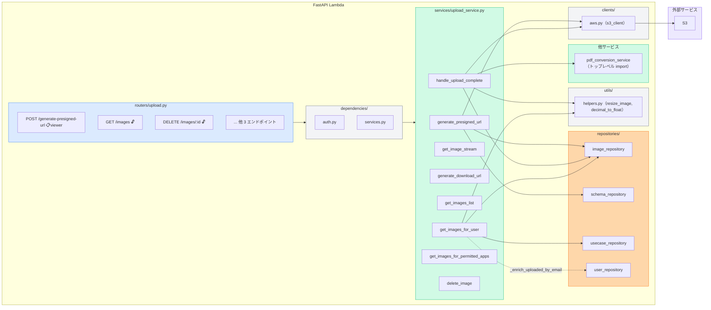
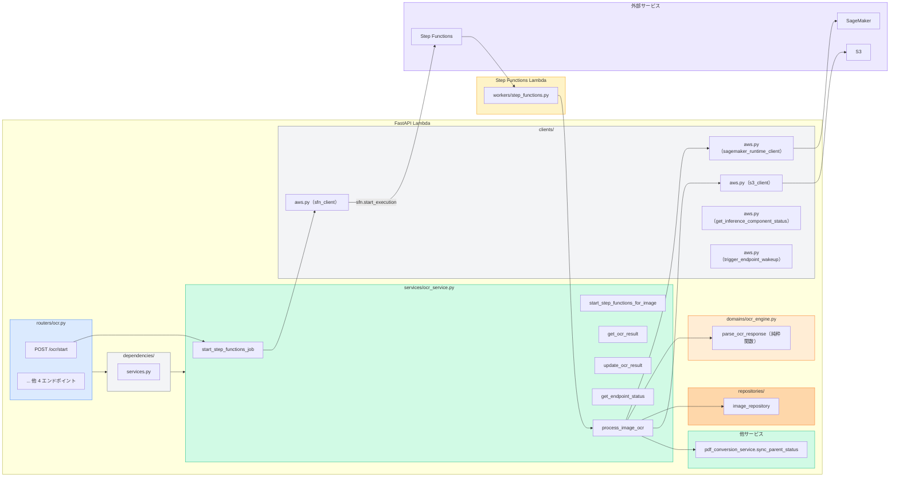
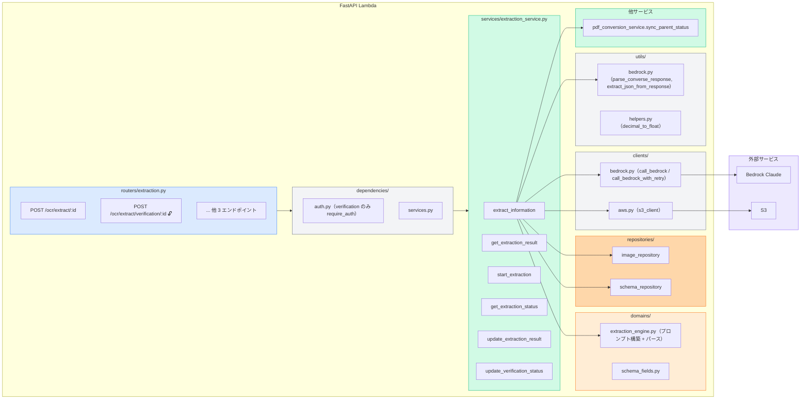
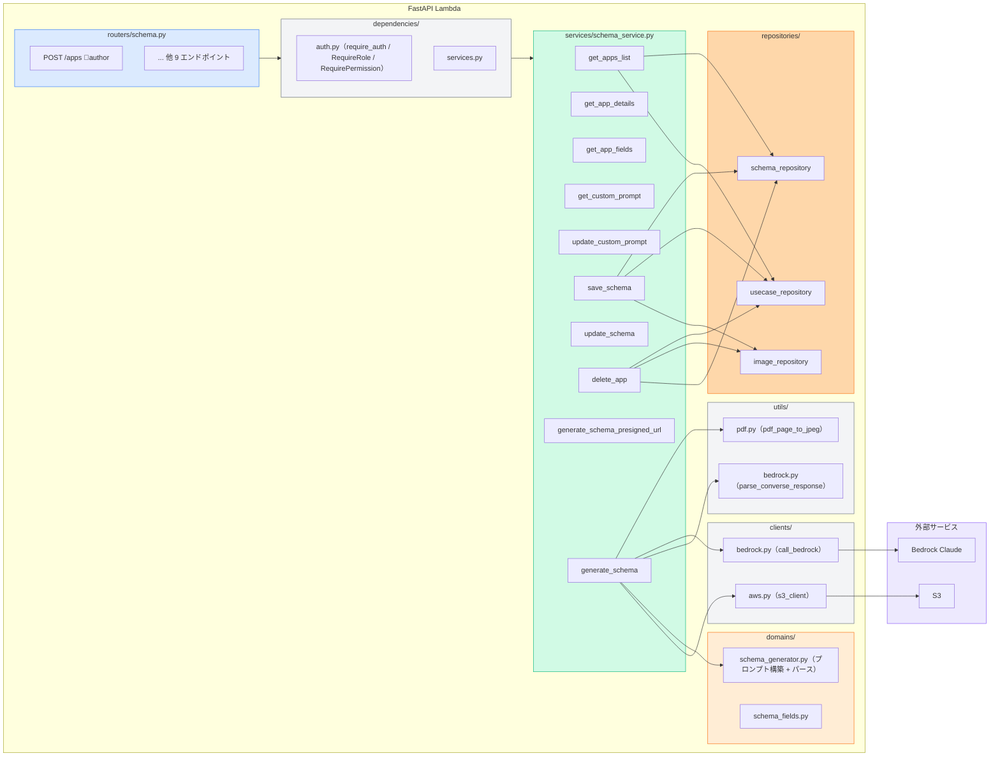
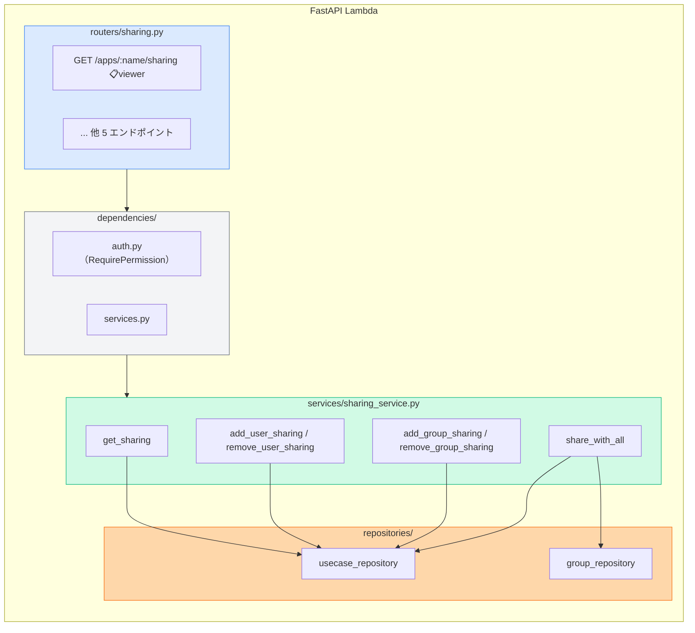
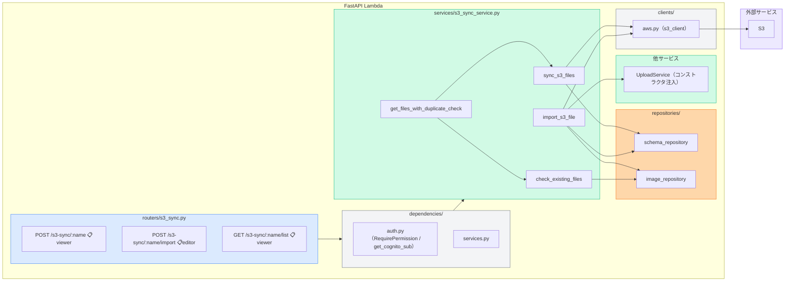
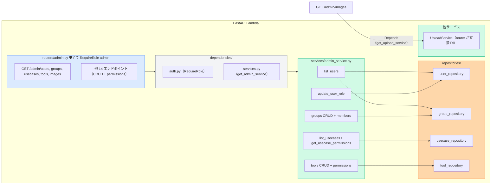
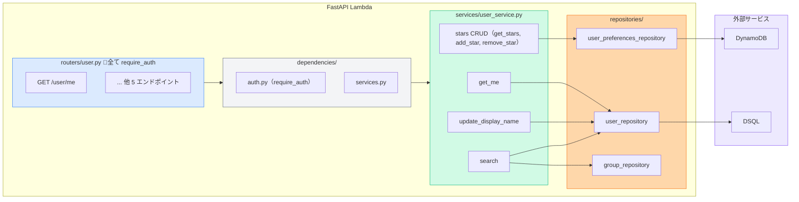
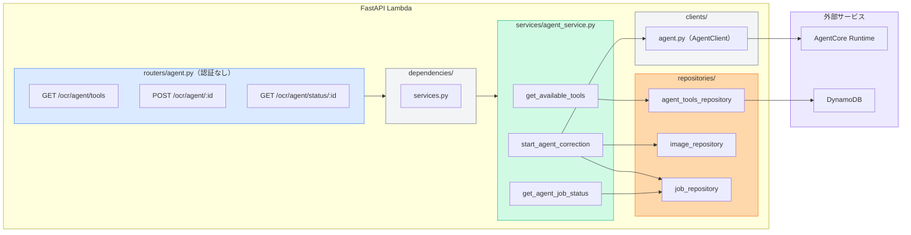
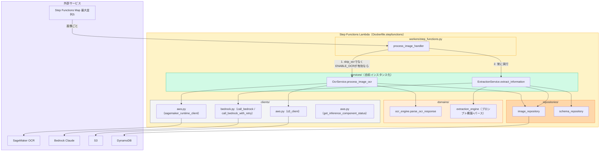

# API Structure

FastAPI ベースの REST API。Lambda (Docker) + API Gateway でホスティング。

## レイヤー責務

### routers/ — プレゼンテーション層

HTTP リクエスト/レスポンスの入出口。以下に限定する:

- `Depends` ベースの認証・認可
- Pydantic による入力バリデーション（router 内完結のリクエストモデルは router 内で定義可）
- `get_cognito_sub(req)` の取得とサービスへの受け渡し
- サービス呼び出し（`Depends(get_xxx_service)` で DI）
- サービス層のカスタム例外（NotFoundError, LastOwnerError 等）を型で分岐して HTTPException に変換

書いてはいけないもの: ビジネスルール、データレベルのフィルタリング、Repository の直接呼び出し、cognito_sub → email 等のデータ加工

### services/ — アプリケーション層

ユースケース単位のオーケストレーション:

- 複数の Repository / Domain の組み合わせ
- ユーザーの role/権限に応じたデータフィルタリング
- ビジネスルールの適用（「auto グループは削除不可」等）

書いてはいけないもの: HTTP 固有の処理（HTTPException, StreamingResponse 等）。ドメイン例外（ValueError, PermissionError 等）を raise し、router 層で HTTPException に変換する。複数サービスで重複するロジックは utils/ に切り出す

### domains/ — ドメイン層

外部依存を持たない純粋なビジネスロジック。DB や AWS SDK に直接依存しない

### repositories/ — データアクセス層

データストア（DynamoDB, DSQL, S3）への読み書きを抽象化する。ビジネスロジックを含めない

### clients/ — AWS SDK クライアント

クライアント生成・グローバルインスタンス・外部 API ラッパー

### utils/ — 横断的ユーティリティ

画像処理、Bedrock レスポンスパース等の純粋関数。複数サービスで使うものをここに置き、1 サービス専用のものはそのサービス内に置く

### サービス DI パターン

全サービスは `main.py` で `app.state` に生成し、`dependencies/services.py` の `Depends` 関数経由で Router に注入。`workers/step_functions.py` は FastAPI コンテキスト外のため自前でインスタンス生成する

## 認証・認可

| デコレータ | 説明 |
|---|---|
| `Depends(require_auth)` | ログイン必須 |
| `Depends(RequireRole(min_role))` | 指定ロール以上を要求（admin, author, reader） |
| `Depends(RequirePermission(min_level))` | ユースケース単位の権限チェック（owner/editor/viewer）。パスパラメータ `app_name` を自動取得し、user_usecases + group_usecases から最大権限を判定。admin は全スキップ |

エンドポイントレベルの認可は router 層の `Depends` で制御。データレベルの認可（「このデータをこのユーザーに返していいか」）はサービス層で user_id/role を受け取って制御する

---

## サービスごとの構成図

### UploadService

### OcrService

### ExtractionService

### SchemaService

### SharingService

### S3SyncService

### AdminService

### UserService

### AgentService

### Step Functions Lambda

FastAPI Lambda とは別の Lambda。`workers/step_functions.py` がハンドラー実体。
Dockerfile.stepfunctions の CMD が直接 `app.workers.step_functions.process_image_handler` を参照。

