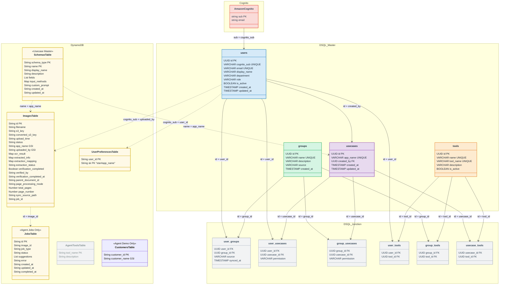

# データモデル設計

## データストアの使い分け

| データストア | 用途 | 選定理由 |
|---|---|---|
| Aurora DSQL | RBAC 権限管理（Users, Groups, Usecases, Tools + 中間テーブル） | VPC 不要のサーバーレス構成。多対多リレーションを中間テーブル + JOIN で表現。OCC によるトランザクション整合性 |
| DynamoDB | 帳票データ（Images, Jobs, Schemas, UserPreferences） | スキーマレスで構造不定のデータ（OCR 結果等）を Map 型で格納。GSI による柔軟なアクセスパターン。Streams で分析基盤への連携が可能 |

前方互換性の観点から、業務データのマスタは DynamoDB に集約されている。DSQL は RBAC 権限管理に特化している。

---

## ER 図

> DSQL は FK 制約非サポート。参照関係はアプリケーション層で管理。
> `app_name` はユースケースの識別子（英数字+アンダースコア）。DSQL・DynamoDB 横断の結合キー。表示名は `display_name` で別管理。

### テーブル役割の補足

- `SchemasTable`（DynamoDB）= ユースケース定義のマスタ。フィールド定義・入力方法・カスタムプロンプト等の設定を保持。元々はこのテーブルだけでユースケースを管理していた
- `usecases`（DSQL）= RBAC 権限管理用に後から追加。SchemasTable の `name`（= `app_name`）で紐付け。ユースケース作成時は SchemasTable → DSQL usecases の順で伝播する
- `ImagesTable`（DynamoDB）= 個々の帳票画像レコード。ユースケースではない。`app_name` でどのユースケースに属するかを示す
- `JobsTable`（DynamoDB）= Agent 検証ジョブ専用。OCR・抽出の処理管理には使われていない（それらは ImagesTable のステータス遷移 + Step Functions で管理）



### 権限解決の流れ

```
1. users.role を確認（admin なら全権限、author なら作成可能、reader なら共有のみ）
2. user_usecases で直接権限を確認
3. user_groups → group_usecases で間接権限を確認
4. 2 と 3 の最大権限を採用（owner > editor > viewer）
```

### Aurora DSQL の制約と設計上の対応

DSQL の制約により、本プロジェクトで明示的に設計を変えている箇所:

| 制約 | 設計への影響 |
|---|---|
| PK は連番（SERIAL）非推奨。UUID 推奨。PK は後から変更不可 | DSQL 側は全テーブルで `gen_random_uuid()` を PK に採用。DynamoDB 側は既存の String UUID をそのまま維持し前方互換性を保持 |
| FK 制約なし（CASCADE DELETE も不可） | 参照整合性はアプリケーション層で管理。DSQL 内の削除は中間テーブル → usecases の順で明示的に DELETE（`delete_group`, `delete_usecase_by_app_name` 参照） |
| OCC（楽観的同時実行制御） | `clients/dsql.py` の `with_retry()` で SerializationFailure を最大3回リトライ（指数バックオフ）。書き込み系の全操作で使用 |
| DDL は 1文/トランザクション | `ddl.sql` で各 CREATE TABLE / CREATE INDEX ASYNC を個別トランザクションで実行。コメントで明記 |

> 参照: [Migrating from PostgreSQL to Aurora DSQL](https://docs.aws.amazon.com/aurora-dsql/latest/userguide/working-with-postgresql-compatibility-unsupported-features.html)
